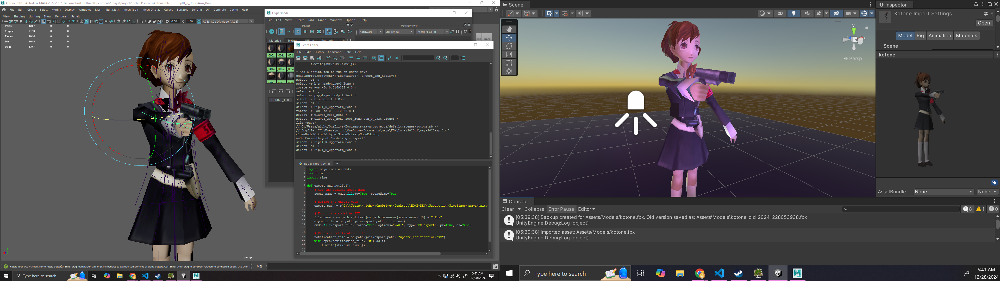

# Maya-Unity Production Pipeline
A custom pipeline for efficient asset management between Maya and Unity. Enables users to edit models in Maya and automatically updates the corresponding asset in Unity, while preserving references and creating a backup of the original model. 


Maya with Python script editor open (left) and Unity scene view with debug logs called from OnPreprocessModel() and OnPostProcessAllAssets() from the AssetPostProcessor class. Note: my repo only comes with the Python and C# scripts, not my sample Unity scene. The model is Kotone from Persona 3 Portable on PSP. 

## Workflow
* Make changes to your model in Maya and save.
* Maya script exports model and creates notification file.
* Unity detects notification file, creates backup copy of existing asset, and reimports the updated model.
* Maintains references to the original asset.

## How to use
### Maya
* Change the export path in the Maya script to match the import path in Unity.
```python
# Define the export path
export_path = r"C:\\Path\\To\\Unity\\Project\\Assets\\Models"
```
* Save the Python script to the Maya scripts directory. 
* Run the script in the Maya scene with the model. Edit the model and save to export.

### Unity
* Define the import path in your Unity project where you want to import models from Maya.
```cs
// Define the import path
private static string notificationPath = "Assets/Models/update_notification.txt";
```
* Create an "Editor" folder in your Unity project and save the C# script inside it.

> [!NOTE]
> This workflow only works in the Unity Editor. It won't work in built games.

## Future work
I have two main extensions in mind for this solution: supporting Blender workflows (e.g., Blender-Unity), as well as Unreal Engine (e.g., Maya-Unreal). If I see a need for it, then I would consider adding support for other DCCs and game engines. The most likely candidate engine as of now is Godot.

## Bugs
Sometimes several backup copies are created. For now, be mindful to delete unwanted assets.